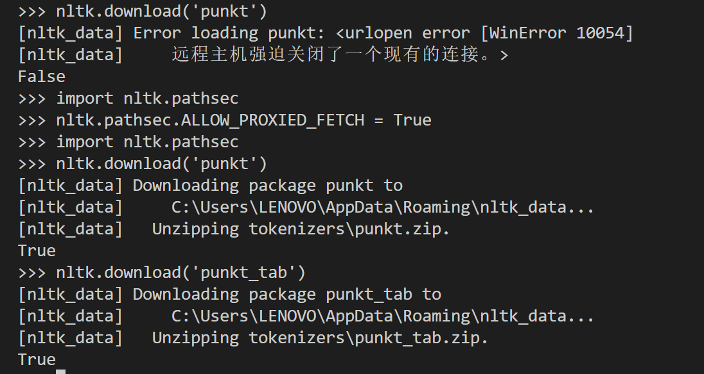

# NLP Homework

## 实验 1：新闻文本分类

使用 NYT 数据完成词袋模型、词向量与 BERT 文本分类，评价指标为 Accuracy 和 Macro-F1。

### 环境配置

实验环境：Python 3.12.6、PyTorch 2.11.0（CUDA 12.8）。以下命令均在仓库根目录运行：

```powershell
python -m pip install pip install nltk
```
下载后其中可能出现如下问题，提供解决方案：


### 数据准备

glove.6B.100d.txt体积过大，不随 Git 上传，运行前准备：
- `Homework1/data/glove/glove.6B.100d.txt`：从 [GloVe 官方压缩包](https://nlp.stanford.edu/data/glove.6B.zip) 解压获得。


train、val、test数据集均进行上传，也可以通过
```powershell
python split.py
```
重新生成。

### 运行命令

```powershell
# Task 1：Binary BoW、Word Frequency 
python binary_bag.py
word_frequency.py

# Task 2：GloVe、AG News Word2Vec、NYT Word2Vec 
python glove.py
python word2vec_ag.py
python word2vec_nyt.py

# Task 3：BERT 微调，最大长度 64，训练 3 轮；自动选择 GPU 或 CPU
python bert.py
```
